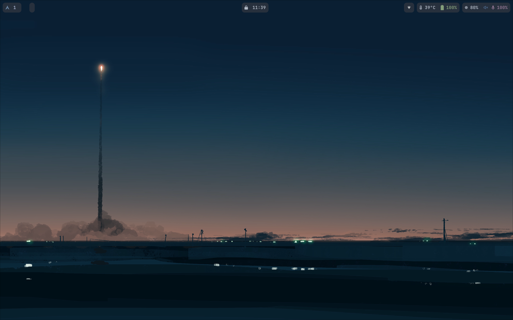
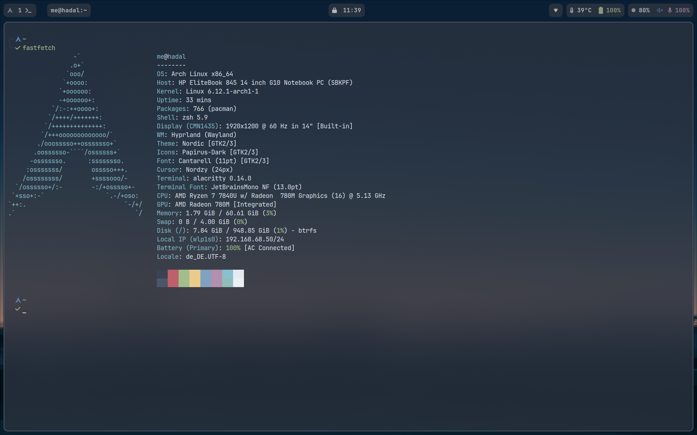

<h1 align="center">
   
   <br>
      Arch Linux on HP Elitebook 845 G10 in Hyprland
   <br>
       <br>

   <div align="center">
      <p></p>
      <div align="center">
         <a href="https://github.com/Unim8trix/HyprElite/stargazers">
            
         </a>
         <a href="https://github.com/Unim8trix/HyprElite/">
            
         </a>
         <a = href="https://archlinux.org">
            
         </a>
         <a href="https://github.com/Unim8trix/HyprElite/blob/main/LICENSE">
            
         </a>
      </div>
      <br>
   </div>
</h1>


### 🖼️ Gallery

<p align="center">
    <br>
    <br>
   Screenshots last updated <b>11.2024</b>
</p>

# 🗃️ Overview

This are my scripts on setting up a HP Elitebook 845 G10 with Arch Linux using Hyprland as window manager.

Iam using full disk encryption and secure boot (microsoft ca disabled in bios).

Main usage is Cloud Development, Virtualization and some gaming.

Localisations are for german, so adjust for your own needs.

A big THANKs to [SOL](https://github.com/SolDoesTech/HyprV2) for getting me into hyprland!

## 📚 Layout

-   [install.sh](install.sh) 📜 Shell script for setting up the complete stuff
-   [config](config) ⚙️ configuration files
-   [wallpapers](wallpapers/) 🌄 wallpapers collection

## 📦 List of installed Packages

| Arch packages                          | Description                                                                                   |
| :--------------------------------------| :---------------------------------------------------------------------------------------------|
| **mesa, vulkan-radeon**                | OpenGL and Vulkan drivers for amd gpu |
| **hyprland**                           | The compositor |
| **alacritty**                            | My default terminal |
| **waybar**                             | Top bar |
| **firefox-developer-edition-i18n-de**  | My default browser |
| **nano**                               | Terminal editor |
| **swww**                               | Wallpaper backend |
| **wofi**                               | Application launcher menu |
| **dunst**                              | Graphical notification daemon |
| **xdg-desktop-portal-hyprland**        | Backend for hyprland |
| **thunar**                             | Graphical file manager |
| **thunar-archive-plugin, file-roller** | Thunar archive plugin and tool |
| **tumbler**                            | Thumbnail creation in thunar |
| **mc**                                 | Midnight Commander, Norton Commander clone for console |
| **polkit-gnome**                       | GUI for superuser access |
| **pamixer, pavucontrol**               | Audio tool and settings |
| **brightnessctl**                      | control monitor and keyboard brightness level |
| **bluez-utils, blueman**               | Bluetooth drivers, utils and GUI app |
| **network-manager-applet**             | NetworkManager and applet |
| **gvfs**                               | Automount USB drives,etc |
| **btop**                               | Terminal resource monitor |
| **zfz, jq, yq**                        | some usefull cmdline utils |
| **grim, slurp, swappy**                | Screenshots tools |
| **pacman-contrib**                     | Additional tools for pacman |
| **ttf-jetbrains-mono-nerd**            | Main Font for terminal and waybar |
| **noto-fonts-emoji**                   | Default emoji fonts |
| **ttf-dejavu, cantarell-fonts**        | Used by some apps |
| **ttf-font-awesome**                   | Icons needed for dunst |
| **nwg-look, xfce4-settings**           | GTK theme settings |
| **pipewire**                           | Audioserver |
| **sof-firmware, alsa-firmware**        | Soundcard firmware |
| **xdg-user-dirs**                      | Manager user directories |
| **oh-my-zsh, starship**                | Customize terminal shell |
| **fastfetch**                          | CLI based system information |
| **papirus-icon-theme**                 | Icon theme |
| **nordic-theme, nordzy-cursors**       | Nord based color theme |
| **papirus-folders-nordic**             | Nord based color theme |


## ⌨️ Keybinds

My default ```$mainMod``` is the ```ALT``` key.

<details>
<summary>
Keybindings
</summary>


##### Keybindings
- ```$mainMod, Return, exec, alacritty  # open the terminal```
- ```$mainMod, Q, killactive, # close the active window```
- ```$mainMod SHIFT, Q, exit, # Exit Hyprland all together no (force quit Hyprland)```
- ```$mainMod, L, exec, swaylock # Lock the screen```
- ```$mainMod, E, exec, thunar # Show the graphical file browser```
- ```$mainMod, F, togglefloating, # Allow a window to float```
- ```$mainMod, SPACE, exec, wofi # Show the graphical app launcher```
- ```$mainMod, P, pseudo, # dwindle```
- ```$mainMod, T, togglesplit, # dwindle```

##### Screenshot
- ```$mainMod, S, exec, grim -g "$(slurp)" - | swappy -f -```

#### Audio control
- ```,XF86AudioLowerVolume, exec, pactl -- set-sink-volume 0 -10% && ~/.config/hypr/scripts/dunstMixer.sh```
- ```,XF86AudioRaiseVolume, exec, pactl -- set-sink-volume 0 +10% && ~/.config/hypr/scripts/dunstMixer.sh```
- ```,XF86AudioMute, exec, pactl -- set-sink-mute 0 toggle && ~/.config/hypr/scripts/dunstMixer.sh```
- ```,XF86AudioMicMute, exec, pactl -- set-source-mute 0 toggle && ~/.config/hypr/scripts/dunstMixer.sh```

#### Screen bightness
- ```,XF86MonBrightnessDown, exec, brightnessctl s 10%- && ~/.config/hypr/scripts/dunstBright.sh```
- ```,XF86MonBrightnessUp, exec, brightnessctl s +10% && ~/.config/hypr/scripts/dunstBright.sh```

#### Move focus with mainMod + arrow keys
- ```$mainMod, left, movefocus, l```
- ```$mainMod, right, movefocus, r```
- ```$mainMod, up, movefocus, u```
- ```$mainMod, down, movefocus, d```

#### Switch workspaces with mainMod + [0-9]
- ```$mainMod, 1, workspace, 1```
- ```$mainMod, 2, workspace, 2```
- ```$mainMod, 3, workspace, 3```
- ```$mainMod, 4, workspace, 4```
- ```$mainMod, 5, workspace, 5```
- ```$mainMod, 6, workspace, 6```
- ```$mainMod, 7, workspace, 7```
- ```$mainMod, 8, workspace, 8```
- ```$mainMod, 9, workspace, 9```
- ```$mainMod, 0, workspace, 10```

#### Move active window to a workspace with mainMod + SHIFT + [0-9]
- ```$mainMod SHIFT, 1, movetoworkspace, 1```
- ```$mainMod SHIFT, 2, movetoworkspace, 2```
- ```$mainMod SHIFT, 3, movetoworkspace, 3```
- ```$mainMod SHIFT, 4, movetoworkspace, 4```
- ```$mainMod SHIFT, 5, movetoworkspace, 5```
- ```$mainMod SHIFT, 6, movetoworkspace, 6```
- ```$mainMod SHIFT, 7, movetoworkspace, 7```
- ```$mainMod SHIFT, 8, movetoworkspace, 8```
- ```$mainMod SHIFT, 9, movetoworkspace, 9```
- ```$mainMod SHIFT, 0, movetoworkspace, 10```

#### Scroll through existing workspaces with mainMod + scroll
- ```$mainMod, mouse_down, workspace, e+1```
- ```$mainMod, mouse_up, workspace, e-1```

#### Move/resize windows with mainMod + LMB/RMB and dragging
- ```$mainMod, mouse:272, movewindow```
- ```$mainMod, mouse:273, resizewindow```

</details>

# 🚀 Installation

> [!CAUTION]
> Applying custom configurations, especially those related to your operating system, can have unexpected consequences and may interfere with your system's normal behavior. While I have tested these configurations on my own setup, there is no guarantee that they will work flawlessly for you.
> **I am not responsible for any issues that may arise from using this configuration.**

> [!NOTE]
> This configuration is build for the HP Elitebook 845 G10.
>If you want to use it with your hardware you to review the configuration contents and make necessary modifications to customize it to your needs before attempting the installation!

## Boot arch linux live image

Get the latest live image from [Arch Linux Website](https://archlinux.org/download/) and make a bootable USB stick. Boot the
elitebook with the USB stick.

## Clone this repo and start Installation

Set your keyboard, activate network and clone this repo.

```bash
loadkeys de-latin1-nodeadkeys
iwctl
# station wlan0 connect "YOUR_WLAN_SSID"
timedatectl set-timezone Europe/Berlin
timedatectl set-ntp true
pacman -Sy git
git clone https://github.com/Unim8trix/HyprElite
cd HyprElite
./install.sh
```

# 📝 Manual Config

## Secure Boot

First, go into BIOS Settings: Secure Boot, enable **Clear Keys**, save and reboot.

Install sbctl

```bash
yay -Sy sbctl
```

Create keys (i dont include microsoft ca)

```bash
sudo sbctl create-keys
```

Check if secure boot is in setup mode, if not reboot and enable "Clear keys..." in BIOS

```bash
sudo sbctl status
```

Enroll keys and sign

```bash
sudo sbctl enroll-keys

sudo sbctl sign -s /boot/vmlinuz-linux
sudo sbctl sign -s /boot/EFI/BOOT/BOOTX64.EFI
sudo sbctl sign -s /boot/EFI/systemd/systemd-bootx64.efi

# enable automatic signing using pacman hook
sudo systemctl enable --now systemd-boot-update.service

# check
sudo sbctl verify
```

Now reboot,  boot with secure bios would be automaticly enabled (check with `sudo sbctl status`)

## Gaming

Enable 32-Bit Lib

Comment out `[multilib]` section in `/etc/pacman.conf`

```bash
[multilib]
Include = /etc/pacman.d/mirrorlist
```

Install Vulkan Driver and Libs

```bash
yay -Sy lib32-mesa lib32-vulkan-radeon lib32-vulkan-icd-loader lib32-systemd ttf-liberation
```

Reboot your book and start installing the steam client


```bash
yay -Sy steam
```


<div align="right">
  <a href="#readme">Back to the Top</a>
</div>
